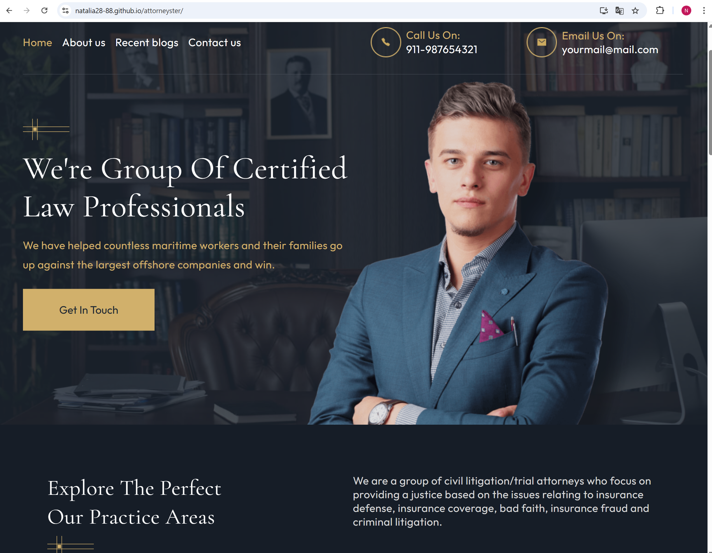
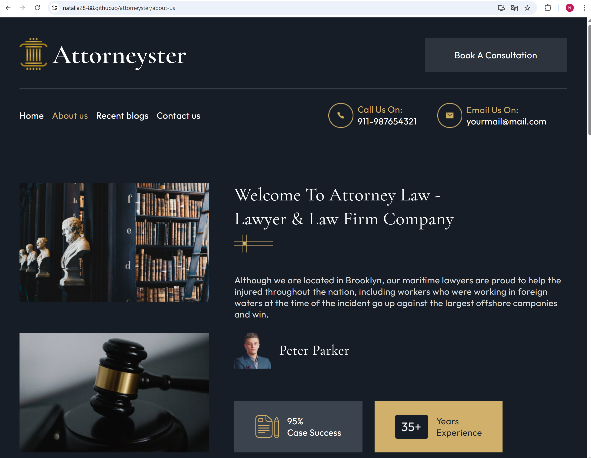
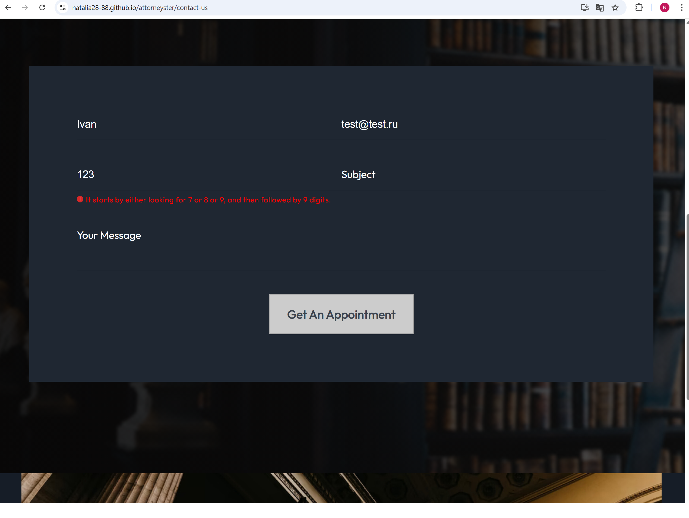
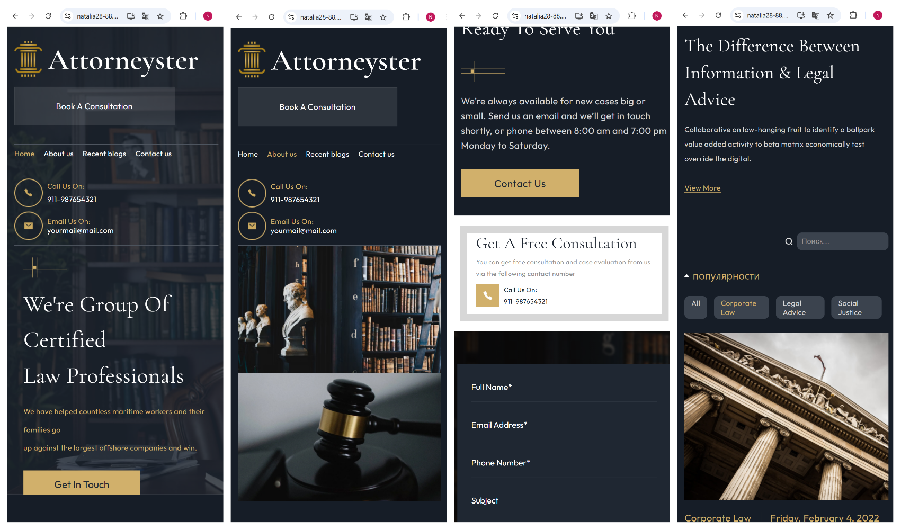

# ⚖️ Attorneyster — Responsive Website for a Law Firm

This is a frontend application built with **ReactJS** and **TypeScript**, developed as an educational project.
The design was originally taken from a landing page mockup.

---

## 📝 Project Description

> My goal was to practice advanced React development by turning a simple landing into a functional **multi-page application**, adding dynamic features like:

- 🔎 Filtering, searching, sorting
- ✅ Form submission with validation (EmailJS + useForm)
- 📊 Mock API integration (axios requests)
- 💤 Lazy Loading optimization

It was an opportunity to consolidate my knowledge of **React, TypeScript, Redux Toolkit, React Router v6**, and modern frontend architecture.

---

## 🛠 Tech Stack

- **ReactJS 18** (Hooks, Code Splitting)
- **TypeScript**
- **Redux Toolkit** (state management)
- **React Router v6** (SPA navigation)
- **Axios** (data fetching)
- **MockAPI** (test backend)
- **SCSS + CSS Modules** (styling)
- **EmailJS** (form submission)
- **Prettier** (code formatting)

---

## 🖼 Screenshots

> 🖼 **Main Page**  
> 

> 🖼 **About us Page**  
> 

> 🖼 **Contact Form with Validation**  
> 

> 🖼 **Responsive Mobile View**  
> 

---

## 🚀 Demo

🔗 [Live Demo](https://natalia28-88.github.io/attorneyster) to view it in your browser.

---

## 💡 Notes

- This is an **educational project**, focused on React development best practices.
- The idea was to **transform a static landing into a real multi-page app** with client-side routing and dynamic interactions.
- Adaptive and responsive layout from desktop to mobile.
- Backend interactions simulated via **MockAPI**.

---

## 📄 License

MIT

---

## 📌 Links

- [GitHub Repository](https://github.com/Natalia28-88/attorneyster)

---

### ✨ Why it's worth showcasing:

> "Not just a layout, but a **functional application** with React state management, dynamic data, form handling, and SPA routing. Great example of taking a static design to a working app."
